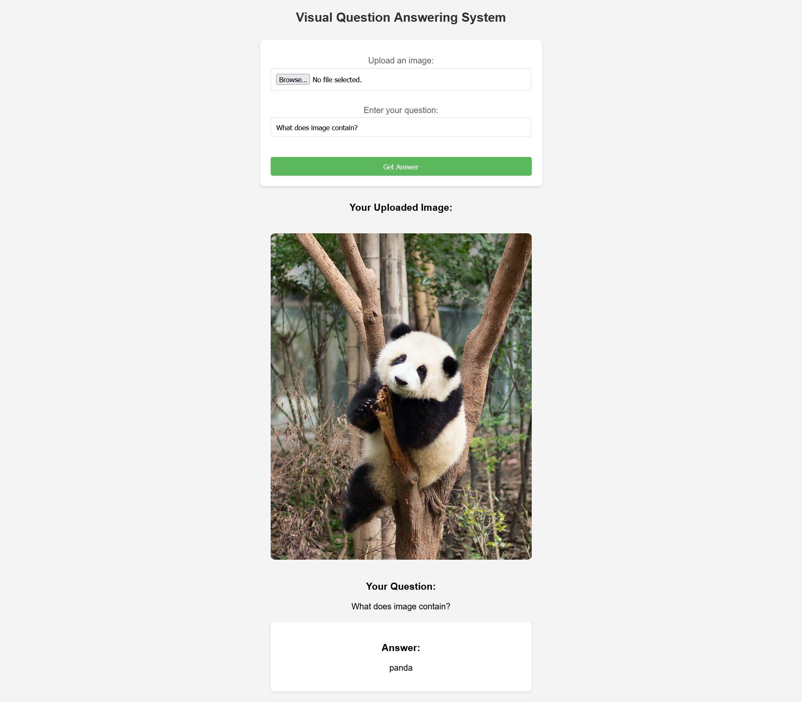

# visual-question-answering
Visual Question Answering System using ViT, GPT, BERT (LLMs)

Tasks:
1. Late Fusion (done)
2. Early Fusion like Chameleon VLM (requires high computation power)
3. (Fine-tuning) Final layer: Classification vs Geneartion layer (some design changes)
4. Can we utilize pre-trained VLM such as BLIP or MiniGPT (simiar to late fusion?)?




Create conda env

```
conda env create -f environment.yml
```


Using docker

```
# run app
python app.py

# use docker
transformers-cli serve --task=fill-mask --model=bert-base-uncased

curl -X POST http://localhost:8888/forward -H "accept: application/json" -H "Content-Type: application/json" -d '{"inputs": "Today is going to be a [MASK] day"}' | jq

docker build --platform linux/amd64 -t vqa:v1 .
# check port from docker ps and use the curl command to get output
```